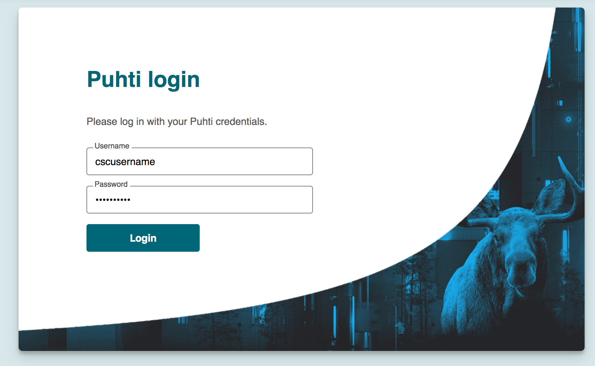

# Provisioning a custom Jupyter notebooks for courses *via* Puhti web interface 

A custom Jupyter notebook to meet the needs of your course environment can be provisioned  at CSC 
through [Puhti web interface](https://www.puhti.csc.fi).  Course organisor (or trainer) needs to take care of customisation of notebook among other things needed for course. Here are few minimal instructions in setting up custom notebooks on Puhti:

- [Get student accounts and resources for course ](#get-student-accounts-and-resources-for-course) 
- [Install necessary computing environment to *projappl* directory using *tykky* wrapper tool](#installing-necessary-python-packages-to-projappl-directory-using-tykky)
- [Creating a course environment/module(s) in Puhti](#creating-a-course-environment-modules-in-puhti)
- [Accessing notebook *via* Puhti web interface](#accessing-notebook-via-puhti-web-interface)
- [Useful CSC documentation](useful-CSC-documentation)

### Get student accounts and resources for course 

One needs to have access to Puhti in order to use Puhti web interface. As a course organiser, you have 
to make sure that all course participants have access to Puhti usage  well before your course starts. 
You can request course accounts for participants *via* CSC [Helpdesk](https://docs.csc.fi/support/contact/).
Accounts are part of the default project which can be used for course. Please note that all installations for your course 
exercises *via* Jupyter notebook should be done in the same default project. However, it is recommended to create 
a separate project for your course in [myCSC web protal](https://my.csc.fi/welcome) if your participants plan to use their own CSC accounts 
for your course and/or it is a reccuring course. Once you create a project you can add course participants to the project in myCSC. 

If you are going to use Puhti for heavy computational exercises and require reservation of computing 
resources for your course, we recommend requesting these resources in Puhti well in advance. 

> note:

>CSC supercomputers have [planned scheduled service breaks](https://research.csc.fi/service-breaks) so please make sure that your course days don't overlap >with service breaks of Puhti.

### Install necessary computing environment to *projappl* directory using *tykky* wrapper tool

Tykky wraps installations of sofwtare tools/packages inside of a container image for improved performance metrics such as faster startup times, 
reduced I/O load, and  fewer number of file creations on Lustre parallel filesystems. Please refer to CSC documentation 
on [tykky](https://docs.csc.fi/computing/containers/tykky/) for more detailed information.

For the installation of computational environment required for your course, use tykky container wrapper tool to install
all needed computing environment in the *projappl* directory. For the purpose of this tutorial, we use [NMRLipids course](https://www.helsinki.fi/en/researchgroups/biophysical-chemistry/nmrlipids-summer-school-2022) set up which needs installation
of several [python packages](#link) for Jupyter notebook as well as the availability of course material downloaded from the github.

Install python packages for course using tykky as below:
```bash
# Navigate to the scratch area of your course project 
cd /scartch/project_xxxx/      # Make sure to replace the correct project number here

# As a starting point, you can clone the current repository that has all necessary scripts/files for the 
# customising your own course environment. The file NMRLipids-course.lua (i.e., coursename.lua) is a module 
# environment file. Replace the "NMRLipids-course" with your course name in the file name of .lua file. 
# This name will be the environment name that you would like to see on Puhti web interface when notebook is
# launched. In side  of the .lua file, you can set the absolute path for bin directory (where you would 
# have installed all the python packages using tykky),configure path for Notebook URL (The notebook that
# you would like to see when you launch Jupyter notebook) and  optional source path for extra material 
# (download  extra matrial on scratch and refer to the link here so that the material will
# be copied to Jupyter notebook directory when Launched).

git clone https://github.com/CSCfi/Puhti_gui_tutorial.git

# Optionally download extra material which will be copied to Jupyter notebook base directory when notebook is laucnhed
git clone https://github.com/NMRLipids/Databank.git  

cd Puhti_gui_tutorial 
module load tykky
mkdir /projappl/project_xxxx/NMRLipids  (e.g., /projappl/project_xxxx/coursename)
# You can wrtite all needed python packages in yaml as in env_nmr.yml for NMRLpids course and install with tykky
conda-containerize new --prefix /projappl/project_xxxx/NMRLipids  env_nmr.yml  #  Installation can take a while
```
Tykky would install all needed packages (as listed in the file, *env_nmr.yml*) to the directory '/projappl/project_xxxx/NMRLipids'. 
Please note that you have to provide absolute path of **bin** directory  (which exists inside the folder of /projappl/project_xxxx/NMRLipids) in the .lua file


### Creating a course environment modules in Puhti

The files for course environments (modules) can be created in the directory /projappl/project_xxxx/www_puhti_modules/. The www_puhti_modules directory can be created if it does not exist.

The two files needed for setting up the course modules are:
   - a <<course_name>>.lua file that defines the module that sets up the Python environment. Only files containing the text Jupyter will be visible in the app.
   - a <<course_name>>-resources.yml that defines the default resources used for Jupyter.
  
For this NMRLipids course, the above mentioned two files are created  in the git repository. so just modify appropriately for your own course and place them in projappl folder as below:

```bash

# Edit the correct project number (in two places in NMRLipids-course.lua file) in the the copied files in /projappl/project_xxxx/www_puhti_modules.

mkdir /projappl/project_xxxx/www_puhti_modules && cp NMRLipids-course* /projappl/project_xxxx/www_puhti_modules

```

### Accessing notebook via Puhti web interface

1. Login to [Puhti web interface](https://www.puhti.csc.fi/public/login.html)
2. Login with CSC or course credentials (Users should have accepted Puhti service in [myCSC](https://my.csc.fi/welcome) page under a course ( or own) project before using this service). Login page is as shown below:



3. Once login is successfull, select "Interactive Sessions" on the top menu bar and then click "Jupyter for courses". 
 On the right hand side you can see the different fields for selection before launching a job.  For this course, select 
 the "Project" and "Working directory corresponding"  to course project. Then you will be able to see "NMRLipids-course" 
 module under the "Course module" field. You can then launch Jupyter notebook whick will be launched in the 
 interaction partition by default. You can also change the default settings by checking "Show custom resource settings".

4. Upon successful launching a job, you can click on "connect to Jupyter" to see the course notebook corresponidng to your course environment (NMRLipids_course in this case).


###  Useful CSC documentation

- [Jupyter for course](https://docs.csc.fi/computing/webinterface/jupyter-for-courses/)
- [Tykky containerisation](https://docs.csc.fi/computing/containers/tykky/)


